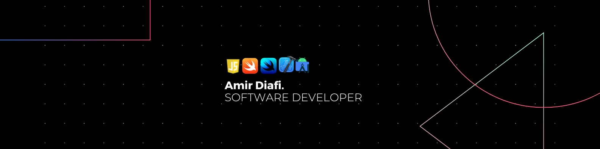

# Hey, I'm Amir 👋

- 👨‍💻 **Frontend Software Engineer**
- ⚡ Skills: **JS**, **TS**, **RactJS**, **Ract Native**, **NodeJS**, **GraphQL**
- 🌱 Learning more about and studying: **SwiftUI**, **Swift UIKit** and more
- 💜 Interests: **Sport 🤾🏻‍♂️**, **Music 🎵**, **Movies 🎬**
- 👋🏻 Feel free to get in touch!

## A passionate programmer with JavaScript and Swift

